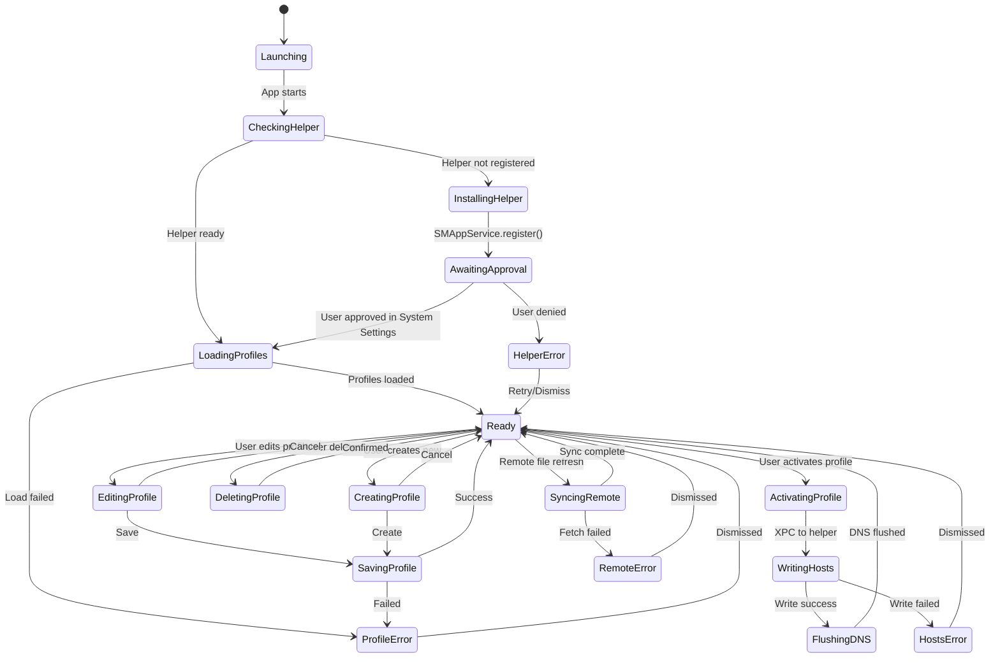
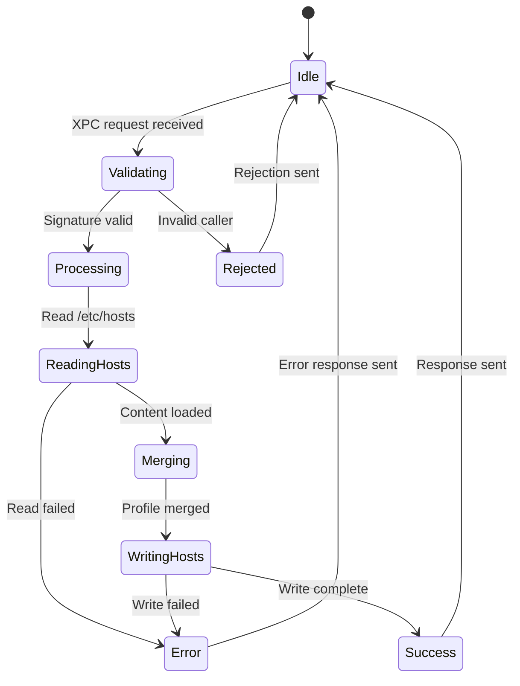
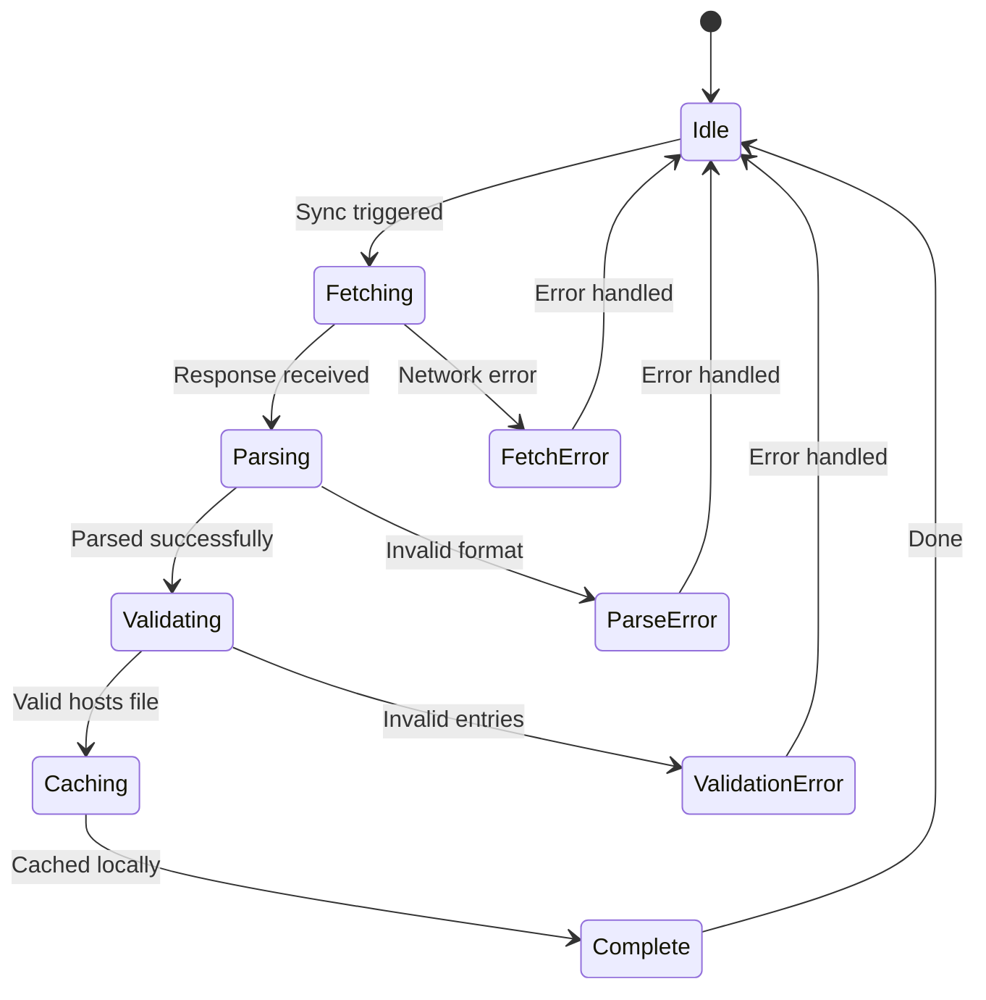
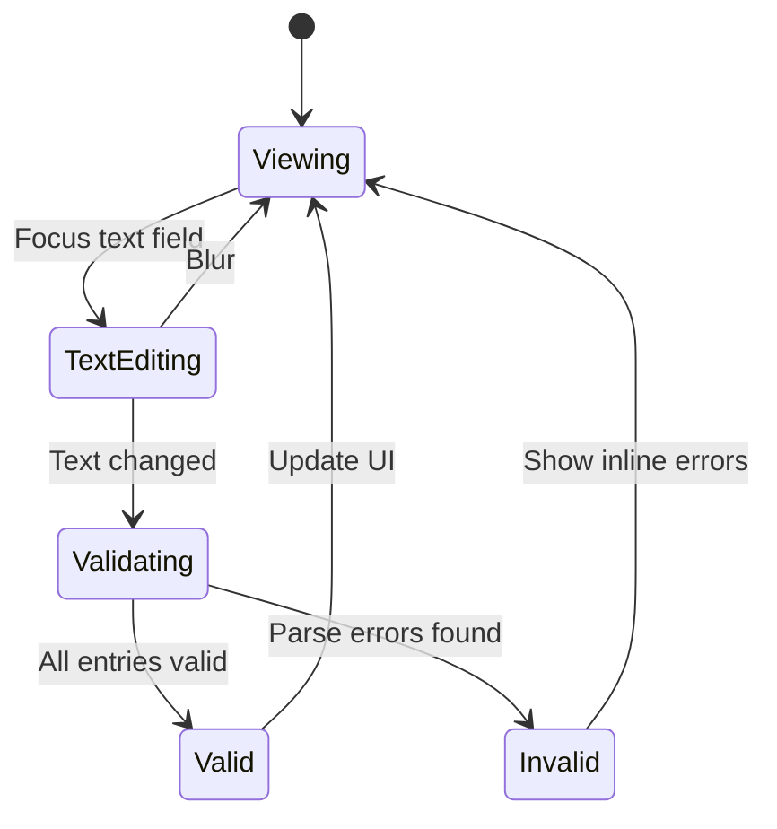
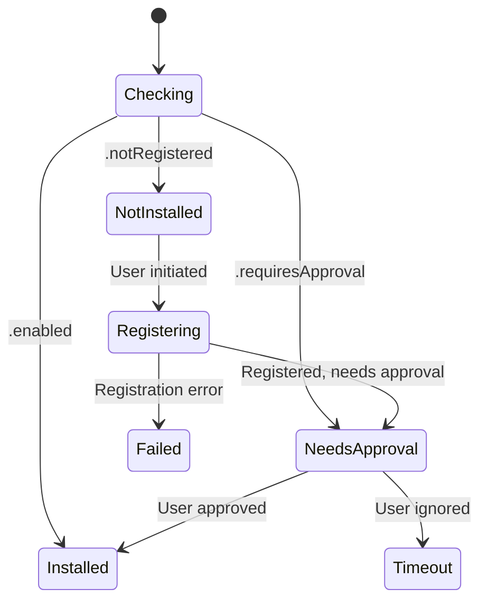

# SaneHosts State Machine Documentation

> Generated: 2026-01-18
> Based on comprehensive research of Gas Mask, Helm, and macOS APIs

---

## 1. State Diagrams

### Main Application State Machine



### Privileged Helper State Machine



### Remote File Sync State Machine



---

## 2. State Details

| State | Description | Entry Actions | Exit Actions |
|-------|-------------|---------------|--------------|
| `Launching` | App cold start | Load user defaults | - |
| `CheckingHelper` | Verify privileged helper status | Call `SMAppService.status` | - |
| `InstallingHelper` | Register helper with system | Call `SMAppService.register()` | - |
| `AwaitingApproval` | User must approve in System Settings | Open System Settings link | - |
| `LoadingProfiles` | Load saved profiles from disk | Read from Application Support | Build profile list |
| `Ready` | Main idle state, UI responsive | Update UI | - |
| `EditingProfile` | User modifying profile content | Load editor with profile | - |
| `ActivatingProfile` | Applying profile to system | Show progress indicator | - |
| `WritingHosts` | Helper writing to /etc/hosts | XPC call to helper | - |
| `FlushingDNS` | Clear DNS cache after write | Execute `dscacheutil -flushcache` | - |

---

## 3. Transitions Table

| From | To | Trigger | Guard | Action |
|------|----|---------| ------|--------|
| `Launching` | `CheckingHelper` | App launched | - | Initialize services |
| `CheckingHelper` | `LoadingProfiles` | Helper status == .enabled | - | Proceed |
| `CheckingHelper` | `InstallingHelper` | Helper status == .notRegistered | - | Register helper |
| `Ready` | `ActivatingProfile` | User taps profile | Profile selected | Validate profile |
| `ActivatingProfile` | `WritingHosts` | Activation started | Helper available | Send XPC |
| `WritingHosts` | `FlushingDNS` | XPC success | - | Flush DNS |
| `WritingHosts` | `HostsError` | XPC failed | - | Show error |

---

## 4. Sub-State Machines

### Profile Editor Sub-States



### Helper Installation Sub-States



---

## 5. Service Dependencies

| Service | Purpose | Availability |
|---------|---------|--------------|
| **SMAppService** | Privileged helper registration | macOS 13+ |
| **XPCSession** | IPC with helper | macOS 14+ (fallback: NSXPCConnection) |
| **FileManager** | Profile storage | Always |
| **URLSession** | Remote file fetch | Always |
| **Process** | DNS flush command | Always |

---

## 6. Concurrency Model

### Main Thread
- All SwiftUI view updates
- User interaction handling
- Profile list management

### Background Queues
| Queue | Purpose | QoS |
|-------|---------|-----|
| `profileIO` | Read/write profile files | `.userInitiated` |
| `networkSync` | Fetch remote hosts files | `.utility` |
| `helperComm` | XPC communication | `.userInitiated` |

### Race Condition Risks

| Risk | Scenario | Mitigation |
|------|----------|------------|
| Concurrent profile writes | User saves while sync completes | Serial queue for profile storage |
| Helper state during install | App checks status while registering | Actor isolation for helper state |
| /etc/hosts concurrent access | Multiple profile activations | Helper enforces serial writes |

---

## 7. Error Handling Matrix

| Error Type | Source | User Message | Recovery |
|------------|--------|--------------|----------|
| `helperNotInstalled` | SMAppService | "SaneHosts needs permission to modify hosts file" | Open System Settings |
| `helperDenied` | SMAppService | "Permission denied. Open System Settings to allow." | Retry button |
| `hostsWriteFailed` | XPC Helper | "Could not write hosts file. Check disk permissions." | Retry |
| `profileCorrupted` | FileManager | "Profile file corrupted. Reset to default?" | Reset option |
| `remoteFetchFailed` | URLSession | "Could not fetch remote hosts file. Check connection." | Retry |
| `invalidHostsFormat` | Parser | "Invalid format in line X: [details]" | Highlight error |

---

## 8. Notifications / Events

| Event | Publisher | Subscribers | Payload |
|-------|-----------|-------------|---------|
| `profileActivated` | HostsManager | UI, MenuBar | `Profile` |
| `profilesChanged` | ProfileStore | UI | `[Profile]` |
| `helperStatusChanged` | HelperManager | UI, Activation | `SMAppService.Status` |
| `remoteSyncCompleted` | SyncService | ProfileStore | `RemoteProfile` |
| `dnsFlushCompleted` | HostsManager | UI | `Bool` |

---

## 9. External API Calls

| API | Purpose | Request | Response |
|-----|---------|---------|----------|
| Remote hosts URL | Fetch hosts file | `GET {url}` | Plain text hosts file |
| SMAppService | Register helper | `.register()` | `throws` |
| XPC Helper | Write hosts | `HostsWriteRequest` | `HostsWriteResponse` |
| `dscacheutil` | Flush DNS | `-flushcache` | Exit code |

---

## 10. Entry/Exit Actions

### State: ActivatingProfile
**Entry:**
1. Show loading indicator
2. Disable profile list interaction
3. Prepare merged hosts content

**Exit:**
1. Hide loading indicator
2. Re-enable profile list
3. Update active profile badge

### State: WritingHosts
**Entry:**
1. Establish XPC connection
2. Send write request
3. Start timeout timer (5s)

**Exit:**
1. Cancel timeout timer
2. Close XPC if needed
3. Log operation result

---

## 11. Invariants

| Invariant | Description | Enforcement |
|-----------|-------------|-------------|
| Single active profile | Only one profile can be active at a time | Deactivate old before activating new |
| Helper must exist to activate | Cannot write hosts without helper | Check helper status before activation |
| System hosts preserved | Never delete system entries (localhost, etc) | Parse and preserve system section |
| Atomic writes | Hosts file never partially written | Write to temp, then atomic move |
| Valid hosts format | All entries must be valid IP + hostname | Validate before save |

---

## 12. Security Considerations

| Concern | Risk | Mitigation |
|---------|------|------------|
| XPC caller validation | Malicious app sends requests | Validate code signature in helper |
| Hosts file injection | User adds malicious redirects | Warn on suspicious entries (e.g., bank domains) |
| Remote file trust | Fetched file contains malware | Validate format, warn on suspicious patterns |
| Helper privilege escalation | Helper does more than intended | Minimal helper API (read/write hosts only) |
| Profile storage tampering | Malicious profile modification | Store in Application Support with proper permissions |

---

## 13. Test Coverage Checklist

### Unit Tests
- [ ] Profile parsing (valid hosts format)
- [ ] Profile parsing (invalid format detection)
- [ ] Merge logic (system + user entries)
- [ ] Remote URL validation
- [ ] Hosts entry validation (IP format, hostname format)

### Integration Tests
- [ ] Helper registration flow
- [ ] XPC communication round-trip
- [ ] Profile save/load cycle
- [ ] Remote file fetch and cache
- [ ] DNS flush execution

### UI Tests
- [ ] Create new profile
- [ ] Edit existing profile
- [ ] Delete profile with confirmation
- [ ] Activate profile
- [ ] Error state display and recovery

### Edge Cases
- [ ] Very large hosts file (>10MB)
- [ ] Unicode in hostnames
- [ ] Duplicate entries in merge
- [ ] Network timeout during remote sync
- [ ] Helper crashes during write

---

## Architecture Decision: Direct /etc/hosts vs NEDNSProxyProvider

### Chosen: Direct /etc/hosts with Privileged Helper

**Rationale:**
1. **Simpler implementation** - No Network Extension complexity
2. **No Apple entitlement approval** - NEDNSProxyProvider requires special approval
3. **Immediate effect** - Changes apply instantly after write
4. **User expectations** - Users expect hosts file editors to edit hosts files
5. **Competitor parity** - Helm uses this approach successfully on App Store

**Trade-offs:**
- Requires privileged helper (SMAppService)
- Not fully sandboxed (helper runs as root)
- User must approve in System Settings

---

## Key Files Structure

```
SaneHosts/
├── SaneHosts/                    # Main app target
│   ├── App/
│   │   └── SaneHostsApp.swift
│   ├── Views/
│   │   ├── MainView.swift
│   │   ├── ProfileListView.swift
│   │   ├── ProfileEditorView.swift
│   │   └── SettingsView.swift
│   ├── ViewModels/
│   │   ├── ProfileViewModel.swift
│   │   └── HelperViewModel.swift
│   ├── Models/
│   │   ├── Profile.swift
│   │   ├── HostEntry.swift
│   │   └── HelperProtocol.swift
│   ├── Services/
│   │   ├── ProfileStore.swift
│   │   ├── HelperManager.swift
│   │   ├── RemoteSyncService.swift
│   │   └── DNSFlushService.swift
│   └── Resources/
├── SaneHostsHelper/              # Privileged helper target
│   ├── main.swift
│   ├── HelperTool.swift
│   └── HostsFileManager.swift
├── Shared/                       # Shared between app and helper
│   ├── HelperProtocol.swift
│   └── HostsParser.swift
└── Tests/
    ├── SaneHostsTests/
    └── SaneHostsUITests/
```
